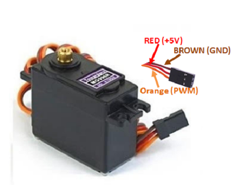
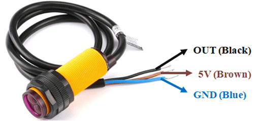

# Narasimha

## Arduino nano pinout

---

Servo ref: https://components101.com/motors/mg996r-servo-motor-datasheet

---

Proximity sensor ref: https://circuitdigest.com/microcontroller-projects/interfacing-e18d80nk-ir-proximity-sensor-with-arduino

## from last time

Pin 9, 10, 11 used for servo
Only pins 2 & 3 are interruptible
Perhaps the pins marked with ~ are for output as well

## Pins

`D2` input from hit. Contact with GND causes interrupt

`D4` input from placement. Low when placed 

`D3` output: for pillar-cracking solenoid

`D5` output: Narasimha light request

`D6` output: Lakshmi Narasimha light request

`D9` fang servo request

`D10` kick servo request

## upcoming trial

Write from python using [write](https://pyserial.readthedocs.io/en/latest/pyserial_api.html)

Read in Arduino using [Serial.read](https://www.arduino.cc/reference/en/language/functions/communication/serial/read/)
